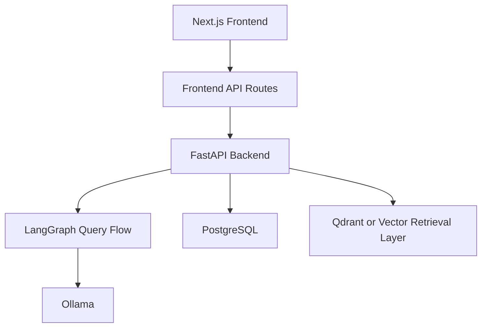

<div align="center">

# AI Codebase Copilot

### Agentic Platform for Codebase Search, Debugging, Indexing, and AI-Assisted Engineering


[Overview](#overview) • [Features](#features) • [Architecture](#architecture) • [Tech Stack](#tech-stack) • [Quick Start](#quick-start) • [API--Routes](#api--routes) • [Project Structure](#project-structure) • [Testing](#testing) • [Documentation](#documentation)

</div>

---

## Overview

AI Codebase Copilot is a local-first AI engineering platform for indexing repositories, searching code semantically, chatting with code context, and managing projects with role-based access. The backend uses FastAPI, LangGraph, PostgreSQL, and vector-based retrieval. The frontend uses Next.js and TypeScript to provide login, project setup, repository management, chat, and admin views.

This README is the single entry point for the project. Deep technical details live under [docs/README.md](docs/README.md).

## Features

- Semantic code search backed by hybrid retrieval.
- Codebase chat using repository-scoped context.
- Repository indexing pipeline with snapshot and job tracking.
- Project, repository, conversation, and message persistence.
- JWT authentication with protected user and admin routes.
- Admin metrics and user visibility for platform oversight.
- Local model support through Ollama.

## Architecture



For detailed architecture, see [docs/architecture.md](docs/architecture.md).

## Tech Stack

- Frontend: Next.js 16, React 19, TypeScript, Tailwind CSS, Jest
- Backend: FastAPI, SQLAlchemy, LangGraph, PostgreSQL, pgvector
- AI and retrieval: Ollama, LangGraph workflows, chunking and hybrid retrieval
- Tooling: Docker or Podman, pytest, Jest

## Quick Start

### Prerequisites

- Python 3.11+
- Node.js 20+
- Docker or Podman
- PostgreSQL with pgvector
- Ollama

### 1. Start infrastructure

```bash
cd infra
podman compose up -d
```

### 2. Start backend

```bash
cd backend
python -m venv .venv
.\.venv\Scripts\Activate.ps1
pip install -U pip
pip install -e .[dev]
python run.py
```

Backend base URL: `http://localhost:8000`
OpenAPI docs: `http://localhost:8000/docs`

### 3. Start frontend

```bash
cd frontend
npm install
npm run dev
```

Frontend URL: `http://localhost:3000`

## API & Routes

### Backend API summary

- `POST /v1/auth/register`
- `POST /v1/auth/login`
- `GET /v1/auth/me`
- `GET /v1/projects`
- `POST /v1/projects`
- `GET /v1/projects/{project_id}/repositories`
- `POST /v1/projects/{project_id}/repositories`
- `POST /v1/projects/{project_id}/conversations`
- `GET /v1/conversations/{conversation_id}/messages`
- `POST /v1/conversations/{conversation_id}/messages`
- `POST /v1/search`
- `POST /v1/chat`
- `POST /v1/index`
- `POST /v1/tools/execute`
- `GET /v1/admin/users`
- `GET /v1/admin/repositories`
- `GET /v1/admin/indexing-status`
- `GET /v1/admin/agent-runs`
- `GET /v1/admin/system-metrics`

### Frontend routes summary

- `/` landing page
- `/login` sign in
- `/register` sign up
- `/dashboard` authenticated dashboard
- `/repositories` project and repository management
- `/chat` repository-scoped AI chat
- `/admin` admin-only metrics and user management

See [docs/backend.md](docs/backend.md) and [docs/frontend.md](docs/frontend.md) for request formats, flows, and route details.

## Project Structure

```text
AI-Codebase-Copilot/
├── README.md
├── backend/
│   ├── app/
│   ├── tests/
│   ├── pyproject.toml
│   └── run.py
├── frontend/
│   ├── src/
│   ├── tests/
│   └── package.json
├── docs/
│   ├── README.md
│   ├── architecture.md
│   ├── backend.md
│   ├── frontend.md
│   ├── project-spec.md
│   └── testing.md
└── infra/
```

## Testing

### Backend

```bash
cd backend
pytest tests/ -v
```

### Frontend

```bash
cd frontend
npm test
npm run test:coverage
```

See [docs/testing.md](docs/testing.md) for test scope and commands.

## Contribution Notes

- Keep documentation updates in the same change as code updates.
- Keep the root README concise; add technical detail under `docs/`.
- Prefer minimal, focused changes over broad rewrites.

## Documentation

- [docs/README.md](docs/README.md) documentation index
- [docs/architecture.md](docs/architecture.md) system architecture and data flow
- [docs/backend.md](docs/backend.md) backend setup, APIs, and operational notes
- [docs/frontend.md](docs/frontend.md) frontend routes, proxies, and user flows
- [docs/project-spec.md](docs/project-spec.md) internal project specification and roadmap
- [docs/testing.md](docs/testing.md) test commands and coverage notes

---

<div align="center">

[Issues](https://github.com/Harshdev625/AI-Codebase-Copilot/issues) • [Pull Requests](https://github.com/Harshdev625/AI-Codebase-Copilot/pulls)

</div>
