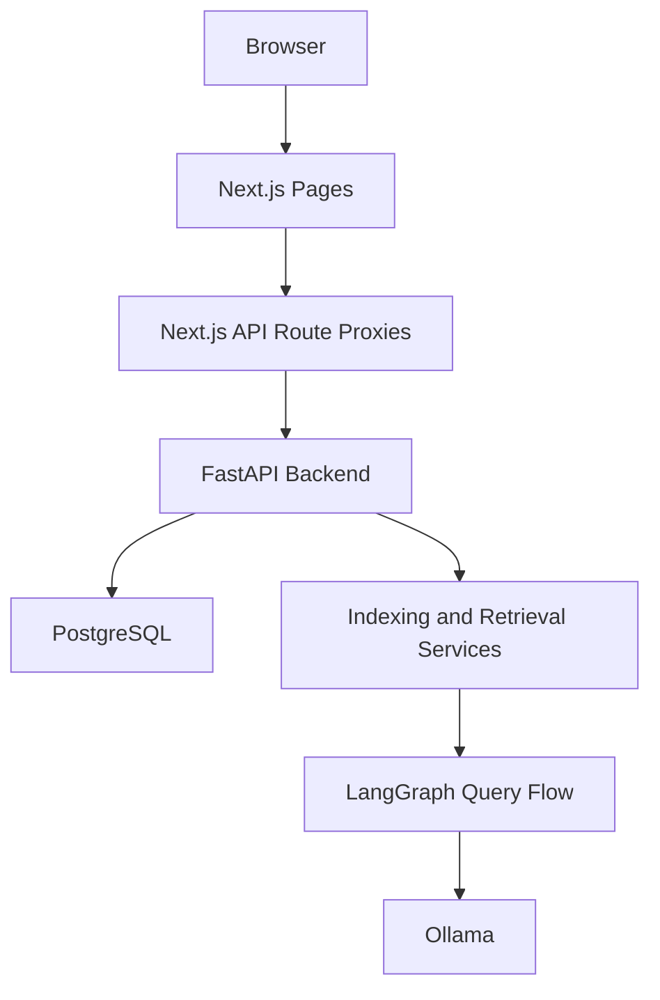

# Architecture

## Overview

AI Codebase Copilot is split into a Next.js frontend and a FastAPI backend. The frontend handles authentication screens, dashboard flows, project and repository management, and chat. The backend handles authentication, persistence, indexing, retrieval, and agent orchestration.

## Runtime Flow

## Backend Structure

- `app/api/v1`: HTTP routes
- `app/core`: config and security
- `app/db`: database connection and schema
- `app/graph`: workflow orchestration
- `app/rag`: chunking, embeddings, retrieval
- `app/services`: indexing and query services
- `app/tools`: controlled tool execution

## Frontend Structure

- `src/app`: routes and API proxy handlers
- `src/components`: reusable UI pieces
- `src/lib`: auth, API helpers, backend URL helpers
- `tests`: unit and integration tests

## Core Data Model

- `users`: registered users with roles and active status
- `projects`: logical grouping for repositories
- `project_memberships`: project access control
- `repositories`: connected repositories and source metadata
- `repository_snapshots`: indexing snapshots
- `indexing_jobs`: indexing status tracking
- `code_chunks`: indexed code chunks for retrieval
- `conversations`/`messages`/`agent_runs`: legacy history tables retained in schema (not part of active API surface)

## Auth Model

- Backend issues JWT access tokens.
- Frontend stores session data locally.
- Protected frontend pages redirect unauthenticated users to `/login`.
- Admin pages are restricted to users whose role is `ADMIN`.
- Normal user signup/login does not accept role from client payloads.
- Admin signup uses dedicated endpoint with server-side secret key validation.
- Frontend revalidates session via `/api/auth/me` and clears session on unauthorized responses.

## Indexing Flow

1. User creates a project.
2. User adds a repository to the project.
3. User triggers indexing through the backend.
4. Backend records a snapshot and indexing job.
5. Indexing service parses files, chunks code, and stores retrieval data.

## Query Flow

1. User selects a repository and asks a question.
2. Frontend calls the backend chat endpoint.
3. Backend verifies repository access.
4. Query service runs retrieval and LangGraph reasoning.
5. Backend returns answer, intent, and source context.

## Admin Flow

Admins can retrieve:

- user list
- repository list
- indexing job history
- aggregate system metrics
- recent activity and service health

Admin access lifecycle:

1. Configure `ADMIN_REGISTRATION_SECRET_KEY` on backend.
2. Create admin via `/register/admin` (frontend) -> `/api/auth/admin/register` -> `/v1/auth/admin/register`.
3. Login via `/login/admin` (frontend) -> `/api/auth/admin/login` -> `/v1/auth/admin/login`.
4. Use `/admin` dashboard and admin API routes.
