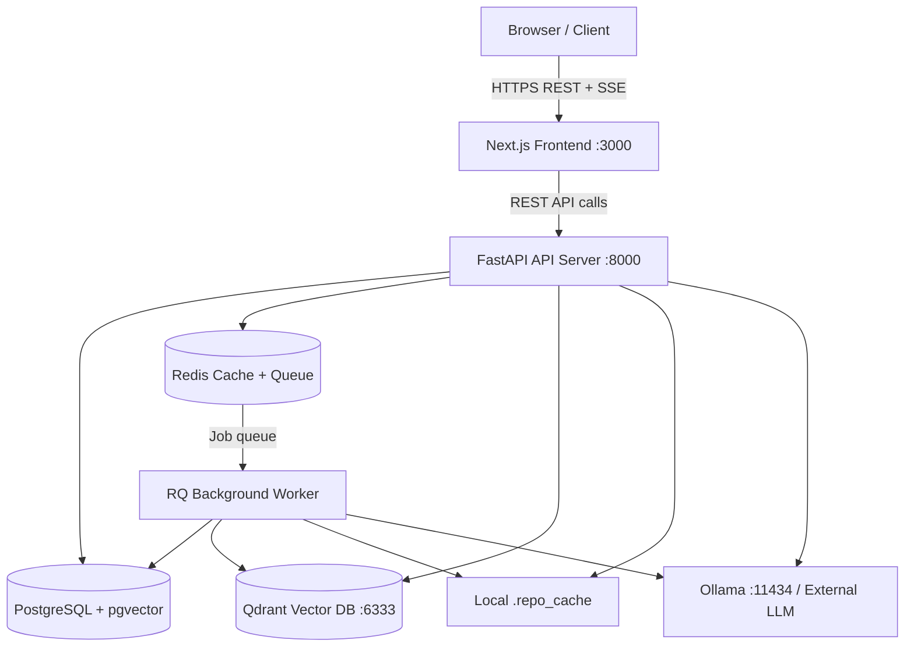
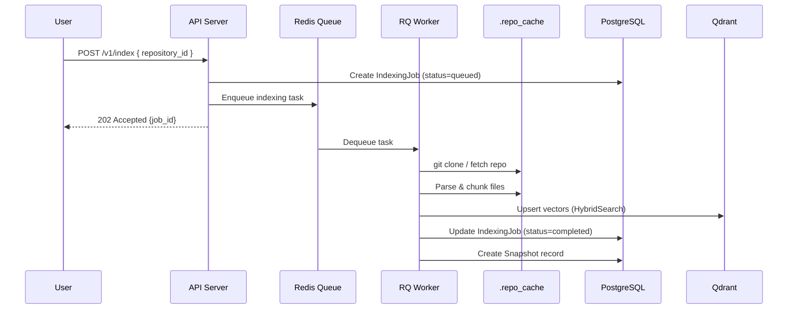
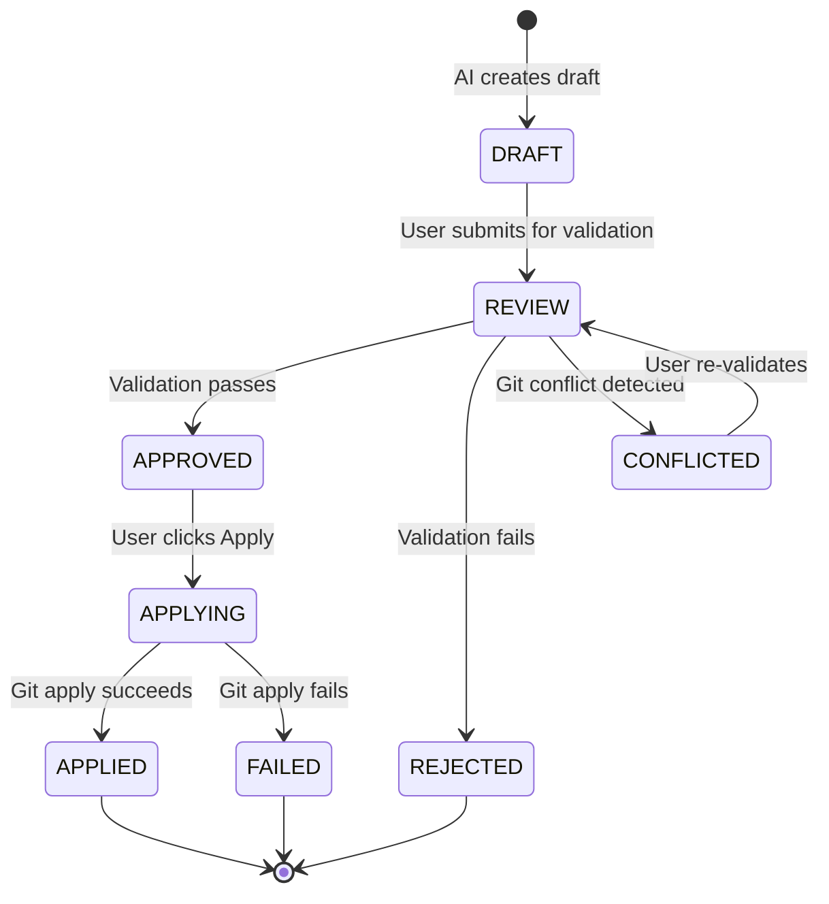
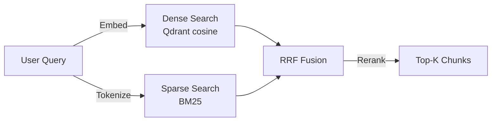
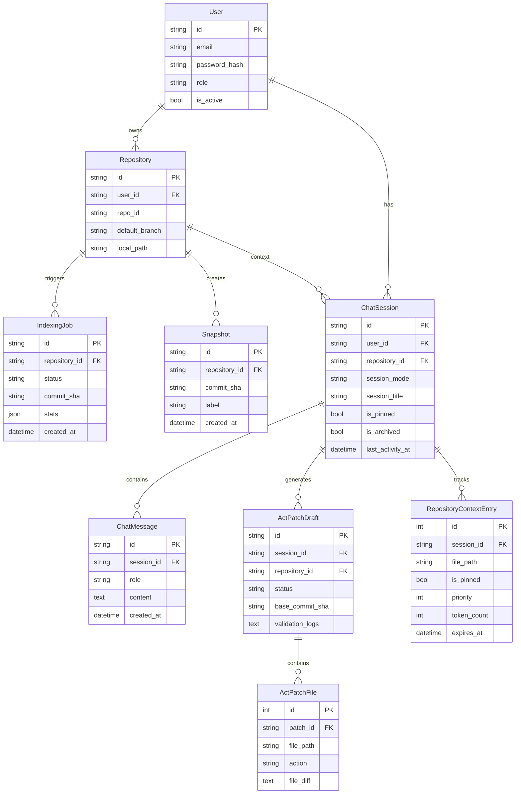
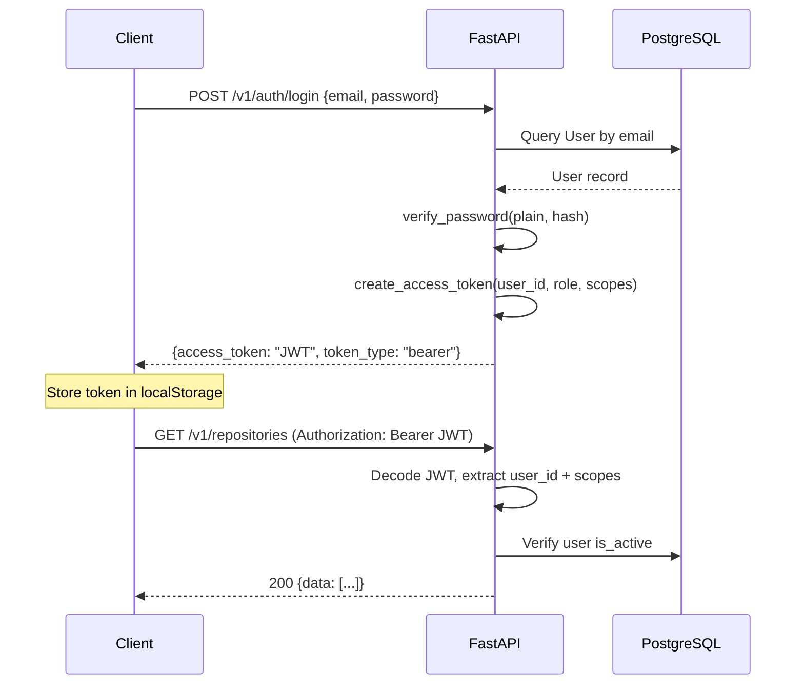

# System Architecture

## 1. High-Level Architecture

AI Codebase Copilot is a self-hosted, local-first AI engineering workspace. It enables developers to index codebases into a vector store, then query, reason about, and modify code through an AI chat interface with ACT (code patch) capabilities.

The system is split into four primary tiers:

| Tier | Technology |
|---|---|
| **Frontend** | Next.js 16 (App Router), React 19, Tailwind CSS v4, Zustand, TanStack Query |
| **API Server** | FastAPI (Python 3.11), SQLAlchemy ORM, JWT auth |
| **Background Worker** | Python RQ worker (Redis queue), runs independently from the API |
| **Data Layer** | PostgreSQL + pgvector, Redis, Qdrant (vector DB), local `.repo_cache` |


```mermaid
graph TD
    Browser[Browser / Client] -->|HTTPS REST + SSE| FE[Next.js Frontend :3000]
    FE -->|REST API calls| API[FastAPI API Server :8000]

    API --> PG[(PostgreSQL + pgvector)]
    API --> Redis[(Redis Cache + Queue)]
    API --> Qdrant[(Qdrant Vector DB :6333)]
    API --> RepoFS[Local .repo_cache]
    API --> LLM[Ollama :11434 / External LLM]

    Redis -->|Job queue| Worker[RQ Background Worker]
    Worker --> PG
    Worker --> Qdrant
    Worker --> RepoFS
    Worker --> LLM
```

---

## 2. Frontend Architecture

### Route Structure

```
/                    → Landing page (redirect to /login)
/(auth)/
  /login             → User sign in
  /register          → User registration
/(user)/
  /dashboard         → Overview: stats, repo list, quick actions
  /workspace         → Classic workspace (legacy; preserved)
  /studio            → Unified Copilot Studio (feature-flagged)
/admin/
  /login             → Admin sign in
  /register          → Admin registration (requires ADMIN_REGISTRATION_SECRET_KEY)
  /dashboard         → Admin control panel
```

### Studio Architecture (Unified Copilot Studio)

The Studio uses a **4-region layout**:

```
┌─────────────────────────────────────────────────────────┐
│  GlobalTopBar (h-11)  Logo · Search · Profile            │
├────┬──────────┬────────────────────────┬─────────────────┤
│ NR │ Sec Panel│     StudioCanvas       │  ContextPanel   │
│12px│  260px   │  (chat/editor/diff/    │  280px          │
│    │  optional│   patch-review)        │                 │
├────┴──────────┴────────────────────────┴─────────────────┤
│ SessionSidebar (260px) | Canvas grows | ContextPanel     │
├─────────────────────────────────────────────────────────┤
│  StatusBar (h-7)                                         │
└─────────────────────────────────────────────────────────┘
```

#### Studio Canvas Modes

| Mode | Trigger | Component |
|---|---|---|
| `chat` | Default / NavRail Chat | `StudioCanvasChat` |
| `editor` | File click in Explorer | `StudioCanvasEditor` (Monaco) |
| `diff` | Snapshot diff open | `StudioCanvasPatchReview` (Monaco diff) |
| `patch-review` | Patch selected | `StudioCanvasPatchReview` |

### State Management

| Store | Purpose |
|---|---|
| `useAuthStore` (Zustand) | JWT token, user profile, logout |
| `useWorkspaceStore` (Zustand + persist) | Tabs, active session/repo, sidebar panel |
| `useStudioStore` (composite) | Wraps WorkspaceStore + studio-specific state (canvas mode, secondary panel, active file) |
| TanStack React Query | All server state: repos, sessions, messages, patches, snapshots |

### Feature Flags

```
NEXT_PUBLIC_STUDIO_ENABLED=true   → Enables /studio route, redirects post-login to /studio
```

The canonical check is `isStudioEnabled()` from `src/lib/feature-flags.ts`. Never read `process.env.NEXT_PUBLIC_STUDIO_ENABLED` directly.

---

## 3. Backend Architecture

### API Routers

| Router | Prefix | Key Responsibilities |
|---|---|---|
| `auth` | `/v1/auth` | Register, login, /me |
| `repositories` | `/v1` | Repositories, indexing (`POST /index`), snapshots, patches, file/tree, insights, session context |
| `chat` | `/v1/chat` | Sessions, messages, streaming (`/stream`), legacy apply-patch |
| `admin` | `/v1/admin` | Users, system metrics, service health, indexing status |
| `dashboard` | `/v1/dashboard` | Summary metrics |
| `webhooks` | `/v1/webhooks` | GitHub webhook handler |

### Indexing Pipeline


```mermaid
sequenceDiagram
    participant U as User
    participant API as API Server
    participant Redis as Redis Queue
    participant W as RQ Worker
    participant FS as .repo_cache
    participant PG as PostgreSQL
    participant Q as Qdrant

    U->>API: POST /v1/index { repository_id }
    API->>PG: Create IndexingJob (status=queued)
    API->>Redis: Enqueue indexing task
    API-->>U: 202 Accepted {job_id}

    Redis->>W: Dequeue task
    W->>FS: git clone / fetch repo
    W->>FS: Parse & chunk files
    W->>Q: Upsert vectors (HybridSearch)
    W->>PG: Update IndexingJob (status=completed)
    W->>PG: Create Snapshot record
```

### ACT Patch Lifecycle


```mermaid
stateDiagram-v2
    [*] --> DRAFT: AI creates draft
    DRAFT --> REVIEW: User submits for validation
    REVIEW --> APPROVED: Validation passes
    REVIEW --> REJECTED: Validation fails
    REVIEW --> CONFLICTED: Git conflict detected
    CONFLICTED --> REVIEW: User re-validates
    APPROVED --> APPLYING: User clicks Apply
    APPLYING --> APPLIED: Git apply succeeds
    APPLYING --> FAILED: Git apply fails
    APPLIED --> [*]
    REJECTED --> [*]
    FAILED --> [*]
```

### RAG Retrieval

Hybrid retrieval combines BM25 + dense vector search with Reciprocal Rank Fusion (RRF):


```mermaid
graph LR
    Q[User Query] -->|Embed| Dense[Dense Search\nQdrant cosine]
    Q -->|Tokenize| Sparse[Sparse Search\nBM25]
    Dense --> RRF[RRF Fusion]
    Sparse --> RRF
    RRF -->|Rerank| Results[Top-K Chunks]
```

---

## 4. Data Model


```mermaid
erDiagram
    User {
        string id PK
        string email
        string password_hash
        string role
        bool is_active
    }
    Repository {
        string id PK
        string user_id FK
        string repo_id
        string default_branch
        string local_path
    }
    IndexingJob {
        string id PK
        string repository_id FK
        string status
        string commit_sha
        json stats
        datetime created_at
    }
    Snapshot {
        string id PK
        string repository_id FK
        string commit_sha
        string label
        datetime created_at
    }
    ChatSession {
        string id PK
        string user_id FK
        string repository_id FK
        string session_mode
        string session_title
        bool is_pinned
        bool is_archived
        datetime last_activity_at
    }
    ChatMessage {
        string id PK
        string session_id FK
        string role
        text content
        datetime created_at
    }
    ActPatchDraft {
        string id PK
        string session_id FK
        string repository_id FK
        string status
        string base_commit_sha
        text validation_logs
    }
    ActPatchFile {
        int id PK
        string patch_id FK
        string file_path
        string action
        text file_diff
    }
    RepositoryContextEntry {
        int id PK
        string session_id FK
        string file_path
        bool is_pinned
        int priority
        int token_count
        datetime expires_at
    }

    User ||--o{ Repository : owns
    Repository ||--o{ IndexingJob : triggers
    Repository ||--o{ Snapshot : creates
    User ||--o{ ChatSession : has
    Repository ||--o{ ChatSession : context
    ChatSession ||--o{ ChatMessage : contains
    ChatSession ||--o{ ActPatchDraft : generates
    ChatSession ||--o{ RepositoryContextEntry : tracks
    ActPatchDraft ||--o{ ActPatchFile : contains
```

---

## 5. Authentication Flow


```mermaid
sequenceDiagram
    participant C as Client
    participant API as FastAPI
    participant PG as PostgreSQL

    C->>API: POST /v1/auth/login {email, password}
    API->>PG: Query User by email
    PG-->>API: User record
    API->>API: verify_password(plain, hash)
    API->>API: create_access_token(user_id, role, scopes)
    API-->>C: {access_token: "JWT", token_type: "bearer"}

    Note over C: Store token in localStorage

    C->>API: GET /v1/repositories (Authorization: Bearer JWT)
    API->>API: Decode JWT, extract user_id + scopes
    API->>PG: Verify user is_active
    API-->>C: 200 {data: [...]}
```

---

## 6. Deployment Architecture

See [`docs/deployment.md`](deployment.md) for full production deployment instructions.

```
┌──────────────┐    ┌──────────────┐    ┌──────────────┐
│  Frontend    │    │  API Server  │    │  RQ Worker   │
│  (Next.js)   │    │  (FastAPI)   │    │  (Python)    │
│  :3000       │    │  :8000       │    │  (no port)   │
└──────────────┘    └──────────────┘    └──────────────┘
                           │                   │
              ┌────────────┼───────────────────┤
              │            │                   │
    ┌─────────┴──┐  ┌──────┴─────┐  ┌─────────┴──┐  ┌──────────┐
    │ PostgreSQL │  │   Redis    │  │   Qdrant   │  │  Ollama  │
    │  :5432     │  │   :6379    │  │   :6333    │  │  :11434  │
    └────────────┘  └────────────┘  └────────────┘  └──────────┘
```
