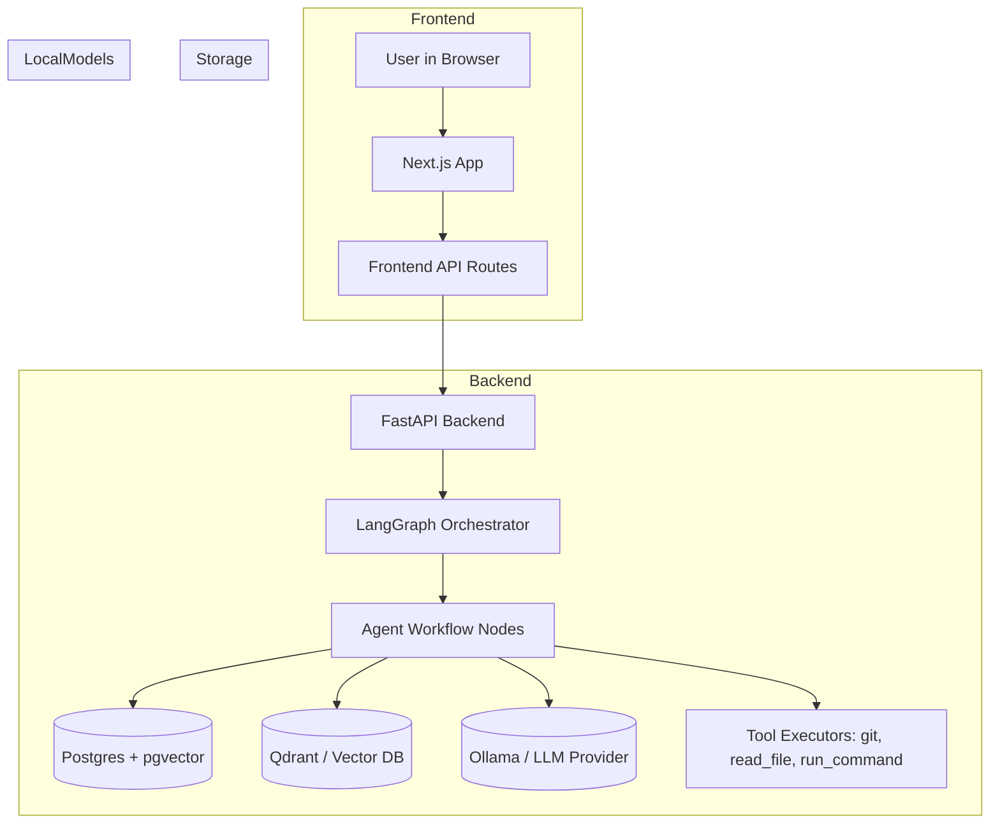

# Project Flow and Agent Overview

This document summarizes how the AI Codebase Copilot agent and application components interact.

## High-level flow

## Agent workflow (summary)

- User initiates actions in the UI: search, chat, index repository, or run tools.
- Frontend routes the request to FastAPI endpoints under `/v1/*`.
- FastAPI translates requests into LangGraph flows or directly invokes service layers.
- LangGraph orchestrates the multi-step agent workflow (nodes):
  - Retrieval node: hybrid retrieval combining dense vectors (embeddings) and traditional search.
  - Planner node: decides next steps and composes prompts or sub-tasks.
  - LLM node: calls Ollama (or configured provider) for generation, summarization, or code-intent extraction.
  - Tool execution nodes: run safe commands (`read_file`, `git_status`, `run_command`) via a validated safety layer.
  - Verifier node: checks outputs, may re-run or refine prompts.
- Results are persisted in Postgres and vector indices as needed and returned to the frontend.

## Typical interactions

- Chat:
  1. User asks a question scoped to a repository.
  2. Backend creates a ChatRequest, retrieves top documents via vector DB + hybrid heuristics.
  3. LangGraph composes context, calls LLM, formats the answer, and returns it to frontend.

- Indexing:
  1. User requests indexing of a repository.
  2. Backend schedules an indexing job that clones (or reads) the repository, chunks files, computes embeddings, and stores them in vector DB.
  3. Job status is tracked in Postgres for admin visibility.

- Tool execution (safe):
  1. User triggers a tool (e.g., `read_file`).
  2. The request passes through `app.tools.safety.is_command_allowed` and command validators.
  3. Approved commands are executed by `terminal_tools` or helper service; outputs are returned to the agent flow.

## Notes and Extensibility

- The system is modular: new LLM providers, vector stores, or tool types can be added by implementing provider adapters and wiring them into the LangGraph workflow.
- For full end-to-end testing, run the infra (`infra/compose.yaml`) to bring up Postgres, Qdrant, Ollama, and other dependencies.

