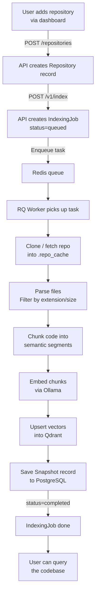
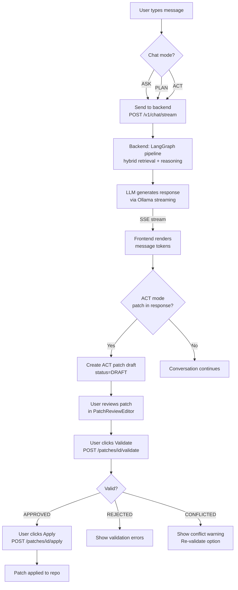
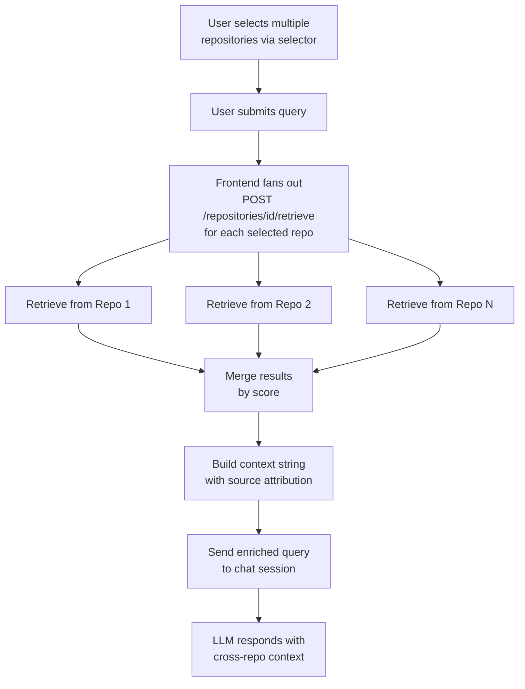
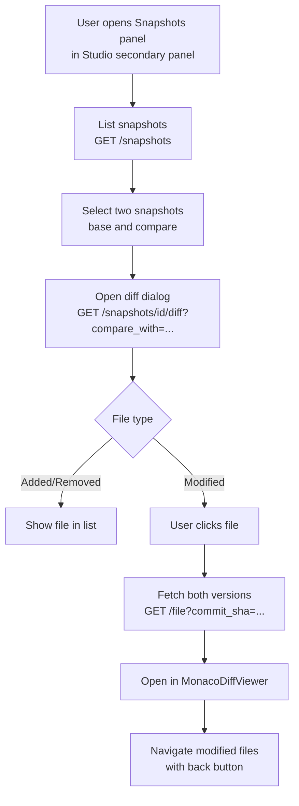
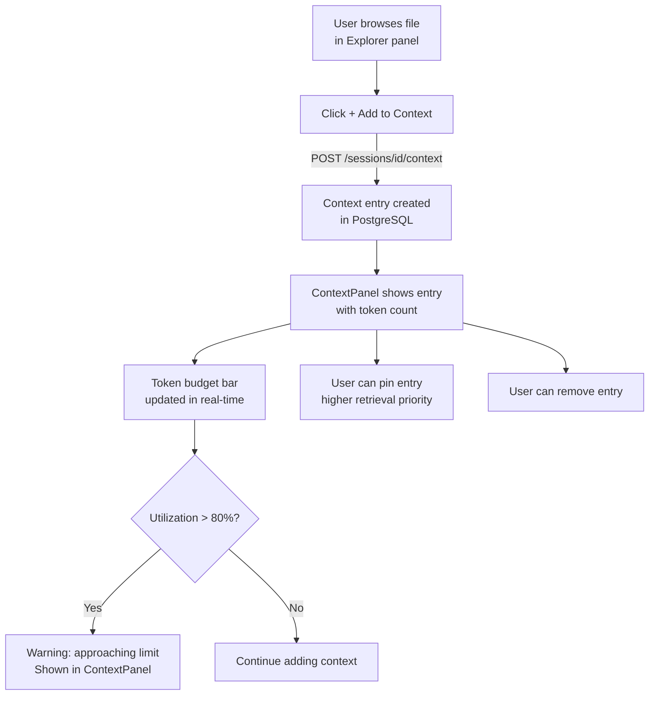
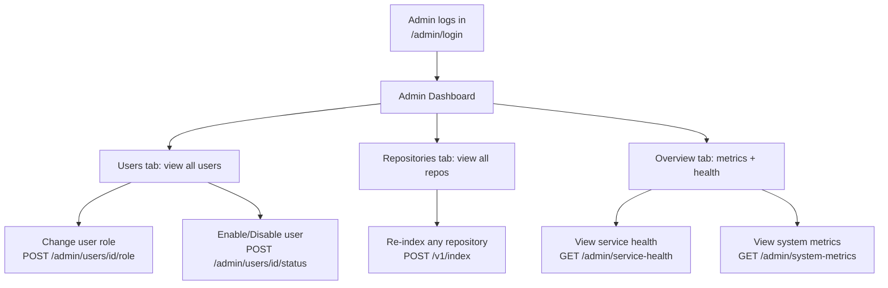

# User Workflow Diagrams

## 1. Repository Indexing Workflow

```mermaid
flowchart TD
    A[User adds repository\nvia dashboard] -->|POST /repositories| B[API creates Repository record]
    B -->|POST /v1/index| C[API creates IndexingJob\nstatus=queued]
    C -->|Enqueue task| D[Redis queue]
    D --> E[RQ Worker picks up task]
    E --> F[Clone / fetch repo\ninto .repo_cache]
    F --> G[Parse files\nFilter by extension/size]
    G --> H[Chunk code into\nsemantic segments]
    H --> I[Embed chunks\nvia Ollama]
    I --> J[Upsert vectors\ninto Qdrant]
    J --> K[Save Snapshot record\nto PostgreSQL]
    K -->|status=completed| L[IndexingJob done]
    L --> M[User can query\nthe codebase]
```

## 2. AI Chat Workflow

```mermaid
flowchart TD
    U[User types message] --> M{Chat mode?}
    M -->|ASK| S[Send to backend\nPOST /v1/chat/stream]
    M -->|PLAN| S
    M -->|ACT| S
    S --> R[Backend: LangGraph pipeline\nhybrid retrieval + reasoning]
    R --> L[LLM generates response\nvia Ollama streaming]
    L -->|SSE stream| F[Frontend renders\nmessage tokens]
    F --> A{ACT mode\npatch in response?}
    A -->|Yes| P[Create ACT patch draft\nstatus=DRAFT]
    A -->|No| D[Conversation continues]
    P --> V[User reviews patch\nin PatchReviewEditor]
    V --> AP[User clicks Validate\nPOST /patches/id/validate]
    AP --> VR{Valid?}
    VR -->|APPROVED| APP[User clicks Apply\nPOST /patches/id/apply]
    VR -->|REJECTED| RE[Show validation errors]
    VR -->|CONFLICTED| CONF[Show conflict warning\nRe-validate option]
    APP --> DONE[Patch applied to repo]
```

## 3. Multi-Repository Query Workflow

```mermaid
flowchart TD
    U[User selects multiple\nrepositories via selector] --> Q[User submits query]
    Q --> P[Frontend fans out\nPOST /repositories/id/retrieve\nfor each selected repo]
    P --> R1[Retrieve from Repo 1]
    P --> R2[Retrieve from Repo 2]
    P --> Rn[Retrieve from Repo N]
    R1 & R2 & Rn --> M[Merge results\nby score]
    M --> C[Build context string\nwith source attribution]
    C --> S[Send enriched query\nto chat session]
    S --> LLM[LLM responds with\ncross-repo context]
```

## 4. Snapshot Comparison Workflow

```mermaid
flowchart TD
    U[User opens Snapshots panel\nin Studio secondary panel] --> L[List snapshots\nGET /snapshots]
    L --> S[Select two snapshots\nbase and compare]
    S --> D[Open diff dialog\nGET /snapshots/id/diff?compare_with=...]
    D --> F{File type}
    F -->|Added/Removed| Show[Show file in list]
    F -->|Modified| Click[User clicks file]
    Click --> FC[Fetch both versions\nGET /file?commit_sha=...]
    FC --> MV[Open in MonacoDiffViewer]
    MV --> Nav[Navigate modified files\nwith back button]
```

## 5. Context Management Workflow

```mermaid
flowchart TD
    U[User browses file\nin Explorer panel] --> Add[Click + Add to Context]
    Add -->|POST /sessions/id/context| CE[Context entry created\nin PostgreSQL]
    CE --> CP[ContextPanel shows entry\nwith token count]
    CP --> TB[Token budget bar\nupdated in real-time]
    TB --> W{Utilization > 80%?}
    W -->|Yes| Warn[Warning: approaching limit\nShown in ContextPanel]
    W -->|No| OK[Continue adding context]
    CP --> Pin[User can pin entry\nhigher retrieval priority]
    CP --> Remove[User can remove entry]
```

## 6. Admin: User & Repository Management

```mermaid
flowchart TD
    A[Admin logs in\n/admin/login] --> D[Admin Dashboard]
    D --> U[Users tab: view all users]
    D --> R[Repositories tab: view all repos]
    D --> O[Overview tab: metrics + health]
    U --> Role[Change user role\nPOST /admin/users/id/role]
    U --> Status[Enable/Disable user\nPOST /admin/users/id/status]
    R --> RI[Re-index any repository\nPOST /v1/index]
    O --> Health[View service health\nGET /admin/service-health]
    O --> Metrics[View system metrics\nGET /admin/system-metrics]
```
