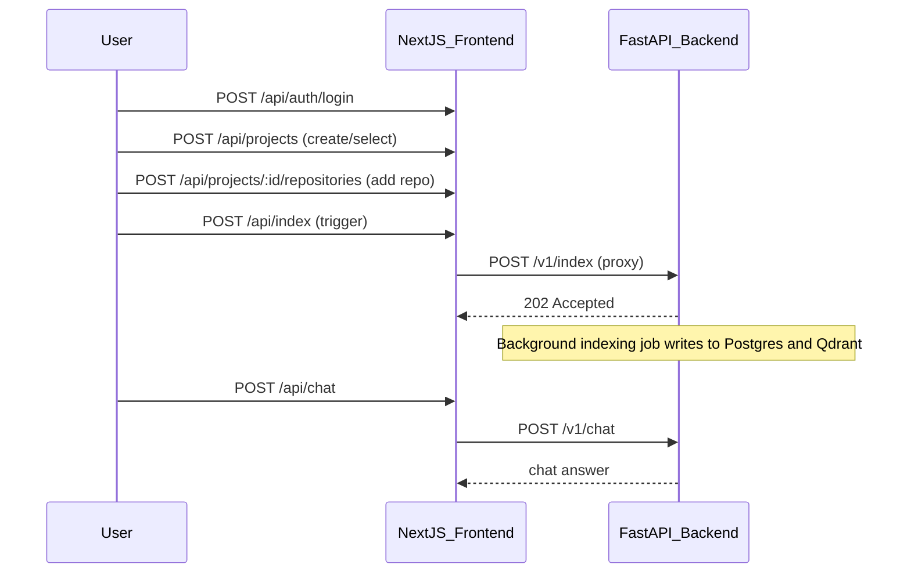

# Frontend Guide

## Purpose

The frontend provides the user-facing application for registration, login, dashboard access, repository management, repository chat, and admin monitoring.

## Run Frontend

```bash
cd frontend
npm install
npm run dev
```

Frontend URL: `http://localhost:3000`

Flow diagram (Mermaid)



## Application Routes

### Public Routes

- `/`
- `/login`
- `/register`
- `/login/admin`
- `/register/admin`

### Protected Routes

- `/dashboard`
- `/repositories`
- `/chat`

### Admin Route

- `/admin`

Route protection is handled in `src/components/app-shell.tsx`.

Rules:

- missing token or user redirects to `/login`
- non-admin access to `/admin` redirects to `/dashboard`
- expired/invalid token triggers session clear and redirect to `/login` (session is revalidated periodically via `/api/auth/me`)

## User Flows

### Login

The login page posts to the frontend proxy route:

- `POST /api/auth/login`

Frontend route to use: `/api/auth/login`

Expected payload:

```json
{
  "email": "admin@aicc.dev",
  "password": "password123"
}
```

### Registration

The registration page calls:

- `POST /api/auth/register`
- `POST /api/auth/login`

Frontend route to use: `/api/auth/register`

Expected payload:

```json
{
  "email": "user@example.com",
  "password": "password123",
  "full_name": "Example User"
}
```

### Admin Registration and Login

Dedicated admin auth paths:

- `POST /api/auth/admin/register`
- `POST /api/auth/admin/login`

Important behavior:

- Standard `/api/auth/register` creates `developer` users only.
- Standard `/api/auth/login` does not accept role in payload.
- Admin login is isolated through `/api/auth/admin/login`.

Frontend pages:

- `/register/admin`
- `/login/admin`

Admin registration payload:

```json
{
  "email": "admin@example.com",
  "password": "password123",
  "full_name": "Platform Admin",
  "admin_secret_key": "your-secret"
}
```

### Repository Management

The repositories page lets a user:

- create a project
- select a project
- add a repository to the selected project
- refresh the repository list

Repository form fields:

- `repo_id`
- `remote_url`
- `local_path`
- `default_branch`

### Chat

The chat page uses the shared chat shell and sends repository-scoped queries through:

- `POST /api/chat`

Payload:

```json
{
  "repo_id": "ai-codebase-copilot",
  "query": "Explain the indexing flow"
}
```

Copilot-style response modes supported in UI:

- Architecture
- Debug
- Refactor
- Docs
- Code

Modes enrich the query prompt so the assistant can better explain architecture, debug issues, suggest refactors, produce docs, and provide implementation guidance.

### Admin Dashboard

The admin page retrieves:

- `GET /api/admin/system-metrics`
- `GET /api/admin/users`

It displays metrics, registered users, and service status cards.

### First Admin Setup

Recommended:

1. Set backend `ADMIN_REGISTRATION_SECRET_KEY`
2. Open `/register/admin` and create admin account
3. Login via `/login/admin`
4. Access `/admin` after session is established

Role decision model:

- Role is not accepted from login/register payloads.
- New users are created as `developer` by backend.
- Admin users are created via admin register + secret key.
- Existing admins can manage user roles from admin endpoints/UI.

## Frontend API Proxy Routes

Current proxy handlers in `src/app/api`:

- `/api/auth/login`
- `/api/auth/register`
- `/api/auth/me`
- `/api/auth/admin/register`
- `/api/auth/admin/login`
- `/api/projects`
- `/api/projects/[projectId]/repositories`
- `/api/chat`
- `/api/admin/system-metrics`
- `/api/admin/users`
- `/api/admin/repositories`
- `/api/admin/indexing-status`
- `/api/admin/users/[userId]/role`
- `/api/admin/users/[userId]/status`
- `/api/admin/users/[userId]`

These routes forward requests to the backend base URL defined in `src/lib/backend-url.ts`.

## Frontend Notes

- Backend URL defaults to `http://localhost:8000/v1`.
- Session state is stored client-side.
- The dashboard behavior changes by role: admins see platform metrics, non-admins see project summaries.
- Dashboard is role-specific: admins see platform-wide insights; developers see user-scoped workspace insights.

Quick dev start (Windows PowerShell)

```powershell
cd frontend
npm install
npm run dev
```

Indexing and proxy routes

- The frontend uses lightweight proxy routes under `/api/*` to forward requests to the backend base URL configured by `frontend/src/lib/backend-url.ts`.
- The repository UI triggers `POST /api/index` which forwards to the backend `POST /v1/index` endpoint. The backend now returns `202 Accepted` and performs indexing in the background; the UI will show an indexing status badge.


## Environment Variables and Configuration

Set runtime configuration via environment variables. Important values:

- `NEXT_PUBLIC_API_URL` — public URL used by the browser to reach the backend (e.g., `http://localhost:8000/v1`).
- `API_INTERNAL_URL` — internal backend URL used when server-side code needs to reach the backend (the codebase prefers `API_INTERNAL_URL` when present).

Example for local development (Unix/macOS):

```bash
export NEXT_PUBLIC_API_URL='http://localhost:8000/v1'
```

On Windows PowerShell:

```powershell
$Env:NEXT_PUBLIC_API_URL = 'http://localhost:8000/v1'
```

## Production Build

To build and preview a production-ready frontend:

```bash
cd frontend
npm install --production
npm run build
npm run start
```

Ensure `NEXT_PUBLIC_API_URL` points to the production backend base URL.
