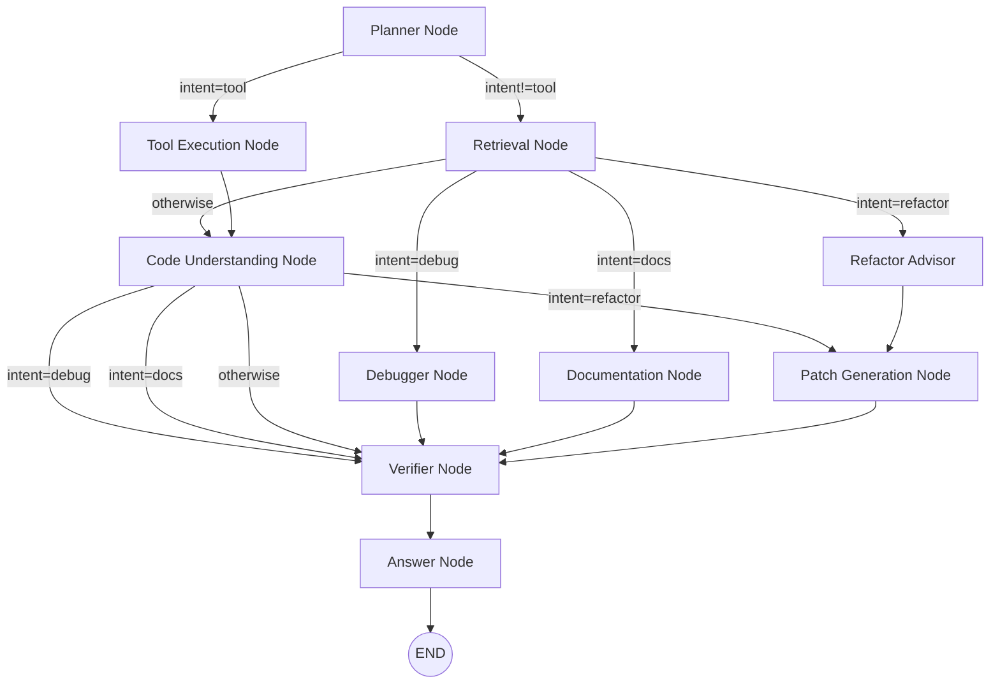

# LangGraph Workflow

This document describes the LangGraph-based agent workflow used by the backend. The implementation lives in `backend/app/graph/workflow.py` and node implementations are in `backend/app/graph/nodes/`.

## High-level mermaid diagram

## Nodes (summary)

- `planner` (app/graph/nodes/planner.py)
  - Inspects the user `query` and sets an `intent` in state: one of `search`, `debug`, `refactor`, `docs`, or `tool`.
  - Minimal rule-based intent detection.

- `retrieval` (app/graph/nodes/retrieval.py)
  - Runs `hybrid_retrieve(...)` to fetch top documents from the retrieval layer (vector + lexical hybrid).
  - Stores results in `retrieved_context`.

- `tool_execution` (app/graph/nodes/tool_execution.py)
  - Executes safe tools where appropriate (`git_status`, `run_command`), guarded by `app.tools.safety.is_command_allowed`.
  - Returns `tool_results` which are available to later nodes.

- `code_understanding` (app/graph/nodes/code_understanding.py)
  - Uses retrieved context and invokes LLM providers to analyze or synthesize explanations.

- `debugger`, `refactor_advisor`, `documentation`, `patch_generation`
  - Specialized nodes that perform targeted tasks such as producing refactor plans or patches, generating docs, or building patches.

- `verifier` (app/graph/nodes/verifier.py)
  - Validates outputs, checks confidence, and may trigger additional refinement.

- `answer` (app/graph/nodes/answer.py)
  - Formats the final assistant response (`answer`, `confidence`, `sources`) and marks the flow as ended.

## State shape (`CopilotState`)

See `backend/app/graph/state.py`. Key fields include:

- `repo_id` (str): repository identifier
- `query` (str): user question
- `intent` (Literal): detected intent
- `retrieved_context` (list[dict]): retrieved docs and snippets
- `plan`, `analysis`, `refactor_plan`, `documentation`, `patch`, `answer` (str)
- `tool_results` (list[dict]): outputs from tool execution
- `run_trace` (list[dict]): trace of node execution for diagnostics
- `verification` (dict): verification results and confidence

## How this ties to services

- Retrieval uses `app.rag.retrieval.hybrid` which combines vector-store results with lexical heuristics.
- LLM calls are routed through the provider adapters (e.g., Ollama provider in `app/rag/embeddings` and model router in `app/llm`).
- Tool invocations use `app.tools` helpers; all executed commands must pass `is_command_allowed`.

## Extending the workflow

- Add a new node in `backend/app/graph/nodes/` exposing a `node(state) -> state` function.
- Register the node in `build_graph()` in `workflow.py` and add edges/conditional routing.
- Update `CopilotState` (typed dict) to include any new state fields required by the node.

## Troubleshooting

- If flows behave unexpectedly, enable debug logging and inspect `run_trace` attached to the response (agent-run diagnostics).
- Ensure retrieval returns meaningful context (indexing must have run and vector DB available).
