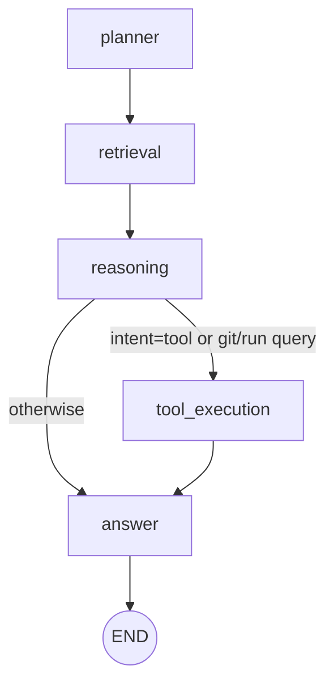

# LangGraph Agent Workflow

The multi-step AI pipeline is orchestrated with **LangGraph**. Source files:

- `backend/app/graph/workflow.py` — graph compilation and routing
- `backend/app/graph/state.py` — `CopilotState` typed dict
- `backend/app/graph/nodes/` — node implementations

`QueryService` invokes the compiled graph when processing chat requests.

---

## Workflow diagram

The live graph is linear with one conditional branch after reasoning:

```mermaid
flowchart TD
  planner[planner]
  retrieval[retrieval]
  reasoning[reasoning]
  tool_execution[tool_execution]
  answer[answer]

  planner --> retrieval
  retrieval --> reasoning
  reasoning -->|intent=tool or git/run query| tool_execution
  reasoning -->|otherwise| answer
  tool_execution --> answer
  answer --> END((END))
```

---

## Node reference

| Node | File | Responsibility |
|---|---|---|
| **planner** | `nodes/planner.py` | Rule-based intent classification: `search`, `debug`, `refactor`, `docs`, `tool`, `patch_generation` |
| **retrieval** | `nodes/retrieval.py` | Hybrid RAG (`hybrid_retrieve`); patch-aware overlay when `patch_id` is set |
| **reasoning** | `nodes/reasoning.py` | Builds analysis, confidence score, and scratchpad from retrieved chunks |
| **tool_execution** | `nodes/tool_execution.py` | Safe git/terminal tools when intent is `tool` or query matches run/git patterns |
| **answer** | `nodes/answer.py` | Formats final assistant output, sources, and patch proposals |

Routing after `reasoning` is defined in `route_after_reasoning()`:

- Routes to **tool_execution** when `intent == "tool"` or the query looks like a shell/git command
- Otherwise routes directly to **answer**
- **tool_execution** always feeds into **answer**

---

## State schema (`CopilotState`)

Defined in `backend/app/graph/state.py`:

| Field | Type | Description |
|---|---|---|
| `repository_id` | `str` | Target repository UUID |
| `repo_id` | `str` | Human-readable repo identifier |
| `project_id` | `str` | Reserved; projects API is disabled (410) |
| `query` | `str` | User prompt |
| `intent` | enum | `search`, `debug`, `refactor`, `docs`, `tool`, `patch_generation` |
| `retrieved_context` | `list[dict]` | Chunks from hybrid search |
| `retrieval_strategy` | `str` | Strategy label for diagnostics |
| `plan` / `analysis` | `str` | Intermediate reasoning scratchpads |
| `refactor_plan` / `documentation` | `str` | Intent-specific outputs |
| `patch` / `patch_proposal` | `str` / `dict` | Generated patch content |
| `tool_results` | `list[dict]` | Audited tool execution results |
| `verification` | `dict` | Confidence and validation metadata |
| `confidence` | `float` | 0–1 retrieval confidence heuristic |
| `run_trace` | `list[dict]` | Per-node diagnostic timestamps |
| `answer` | `str` | Final formatted response |
| `session` | `Any` | SQLAlchemy session (internal) |

---

## Patch-aware retrieval

When ACT mode supplies a `patch_id`, the retrieval node queries both base indexed chunks and ephemeral patch chunks. Overlays exclude deleted files and merge modified file contents so the LLM sees the proposed state.

See `backend/app/rag/retrieval/hybrid.py` and `backend/tests/unit/test_act_retrieval.py`.

---

## Testing

Unit tests cover individual nodes and retrieval integration:

- `tests/unit/test_planner.py`
- `tests/unit/test_reasoning_node.py`
- `tests/unit/test_tool_execution_node.py`
- `tests/unit/test_act_retrieval.py`
- `tests/unit/test_hybrid_retrieval.py`

There is no stochastic eval suite for end-to-end graph quality; manual chat verification is recommended after prompt or routing changes.
